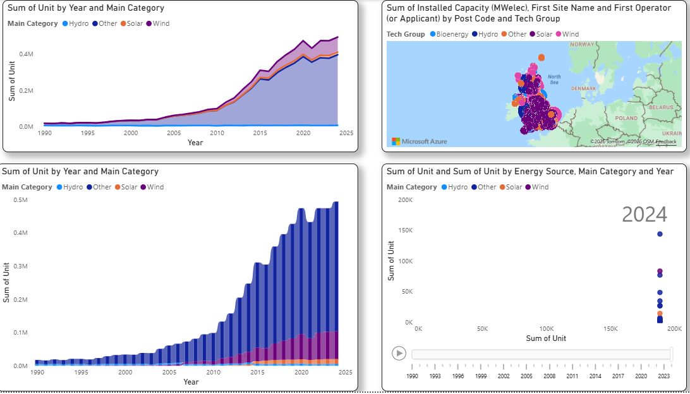
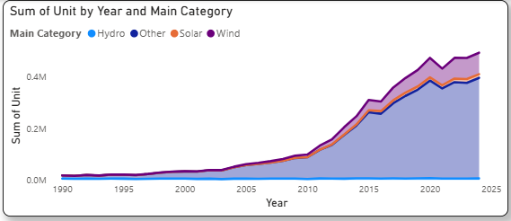
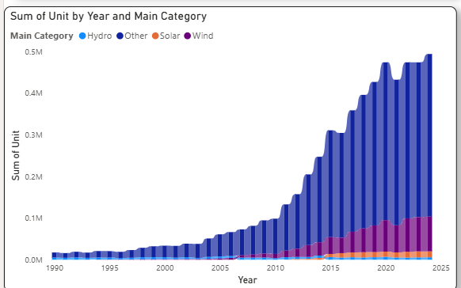
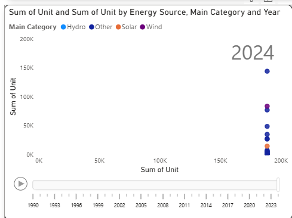
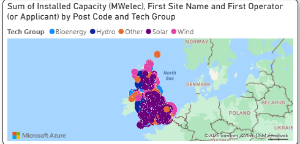

# ⚡ UK Renewable Energy Transition: A Business Intelligence Analysis

## 📌 Executive Summary
This project analyzes the 30-year evolution of the UK's renewable energy sector (1990–2024). By extracting and transforming official GOV.UK datasets, this interactive Power BI dashboard visualizes the shift from fossil fuels to renewable infrastructure, highlighting capacity growth, generation efficiency, and geographic distribution.

## 🗄️ Data Sources
The raw data was sourced from official UK government databases:
1. **[Digest of UK Energy Statistics (DUKES)](https://www.gov.uk/government/statistics/renewable-sources-of-energy-chapter-6-digest-of-united-kingdom-energy-statistics-dukes)**: Historical data on installed capacity (MW) and generation (GWh).
2. **[Renewable Energy Planning Database (REPD)](https://www.gov.uk/government/publications/renewable-energy-planning-database-monthly-extract)**: Q4 2025 extract detailing project locations, status, and operators.

## 🛠️ Data Preparation & ETL (Power Query)
Real-world government datasets require significant cleaning. The following transformations were applied in Power BI's Power Query Editor to prepare the data for relational modeling:

* **Unpivoting for Time-Series Analysis:** Transformed the "Wide" DUKES datasets (years as columns) into a "Long" format to enable dynamic time-series filtering across the dashboard.
* **Anomaly Handling & Type Conversion:** Cleaned text anomalies (e.g., replacing unavailable data markers like `[x]` with `0`) to enforce strict numerical data types for Capacity and Generation columns.
* **Dimensional Hierarchy Creation:** Built a conditional `Tech Group` column across all disparate datasets (grouping 20+ granular sources into 5 core categories: Wind, Solar, Hydro, Bioenergy, and Other) to allow for seamless cross-filtering.
* **Noise Reduction & Geographic Integrity:** Reduced the 50+ column REPD dataset down to 8 essential fields, filtered strictly for "Operational" statuses, and cleaned UK Post Codes to ensure accurate spatial mapping.

## 🔗 Data Modeling
To enable full dashboard interactivity, a customized Star-Schema-inspired model was built:
* Established relationships between the DUKES Capacity, Generation, and Market Share tables using a standardized `Year` key.
* Linked the historical DUKES generation timelines to the REPD infrastructure mapping to allow users to watch geographic expansion sync with generation output.

## 📊 Visualizations & Business Insights

### 1. Market Share Displacement (100% Stacked Area Chart)
Illustrates how renewables aggressively captured market share, moving from a niche grid contributor in 1990 to dominating the UK energy mix by 2024.

### 2. The Technology Race (Ribbon Chart)
Replaces static categorical charts to visualize rank shifts over time. Clearly demonstrates how Wind power physically overtook Bioenergy and Hydro to become the undisputed leader in UK generation.

### 3. The Efficiency Frontier (Scatter Plot with Play Axis)
A dynamic capacity (MW) vs. generation (GWh) analysis. Animating this over time highlights utilization efficiency—showing that while capacity was built steadily, offshore wind generation surged exponentially due to technological improvements.

### 4. Geographic Infrastructure (Proportional Map)
Maps the exact coordinates of operational plants, proving the geographic split: Wind dominating the coastal/northern regions and Solar dominating the south.

## 🚀 Future Scope
The next phase of this project involves migrating the cleaned dataset into a custom web environment using **D3.js** to build fully coded, animated SVG data visualizations.
